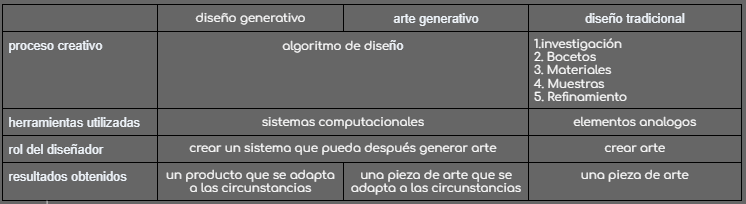

#### Diseño generativo y arte generativo

##### #1 Wikipedia:
Es una herramienta que tienen los diseñadores para innovar.

Mediante el uso de la computación en la nube, el diseño generativo puede recorrer miles o incluso millones de opciones de diseño, probar configuraciones y aprender de cada iteración qué funciona y qué no.

##### #2 Bruno Faúndez

[Youtube](https://www.youtube.com/watch?v=FGky8DjXWM0&ab_channel=BrunoFa%C3%BAndez)

El artista crea un sistema, y de este sistema surge la obra
El arte generativo se refiere a cualquer practica artistica donde el artista es un sistema, tal como un conjunto de reglas naturales, un programa de computador, una maquina u otra invencion procedural, que se pone en movimiento con un grado de autonomia, contribuyendo o resultando en un trabajo completo de arte

##### #3 Patrik Hübner

Patrik convina el diseño de comunicacion, gestion de marca y storytelling con sistemas generativos.
En un mundo que esta sobresaturado por publicidad, el arte generativo le da un nuevo aire y permite enganchar con el publico de maneras que antes no era posible.

##### Diseño generativo

Es crear un software que pueda generar arte dependiendo del usuario.
El diseñador crea el programa, y el programa crea la obra de arte.
Al ser un programa, su estructura depende de algoritmos.
