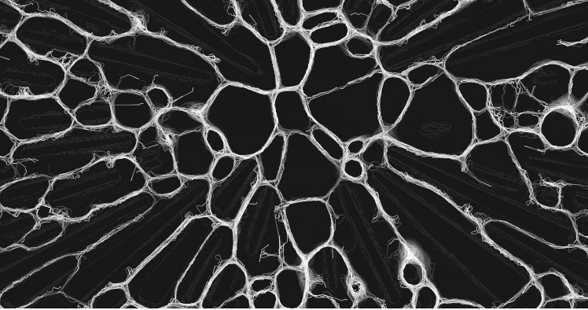
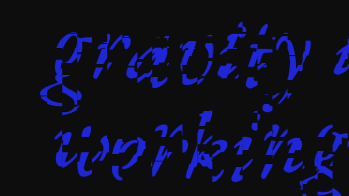
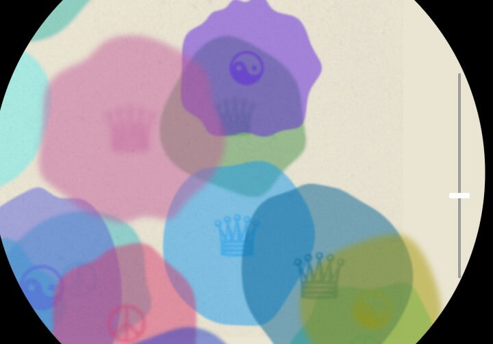

Slime Molds Patt Vira

[URL](https://p5js.org/sketches/2213463/)

Simulador de baba, elige entre seguir el recorrido ya echo o crear un nuevo camino

Gravity Arjun

[URL](https://p5js.org/sketches/2218758/)

El usuario controla con el movimiento del mouse algunas particulas del texto

Microscope Simulator TKt | 陳建中 Tân Kiàn-tiong（rainsr7235）

[URL](https://p5js.org/sketches/2111906/)

El programa genera aleatoriamente bacterias y el usuario panea el microscopio

