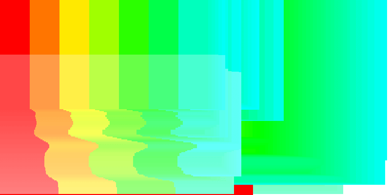

Generación de patrones visuales
Enunciado:

Ingresa al sitio alemán Generative Design.Experimenta con tres ejemplos. Para cada ejemplo:

Descripción: describe qué hace y qué parámetros se utilizan para la generación.
Variaciones: crea al menos dos variaciones, modificando sus parámetros.
Aplicación potencial: describe una posible aplicación de cada ejemplo en el contexto del entretenimiento digital.
Entrega: para cada ejemplo describe cómo funciona, cuáles son los parámetros y muestra el código y una captura de 
pantalla, gif animado o un video corto con tus variaciones.


#### P_1_1_1_01

##### Descripción:

La aplicacion genera un gradiente dependiendo de la posicion x,y del cursor. Al estar en la esquina inferior derecha, la imagen sera totalmente roja, al poner el cursor en la coordenada 0,0, se vera una gradiente de todo el espectro visible.

##### Variaciones:

1. Le cambie la funcion que revisa la posicion del cursor, agregandole una division. Esto genero una distorcion en la imagen.
2. Le cambie la funcion que genera el color, agregandole una division. Esto genero un cambio en el producto de arte final.

##### Aplicación potencial:

1. La aplicacion se podria convinar con sonidos para generar una experiencia en el usuario, que no solo sea curioso para los ojos, sino tambien otros sentidos.
2. La aplicacion podria usar una ecuacion mas compleja para mostrar diferentes colores.

##### Entrega:

1. La variacion revisa las coordenadas x,y del cursor y con base a estas genera franjas de color, los parametros son la posicion del cursor dividida por 2.
2. La variacion divide por 2 el valor del color a utilizar



```js
'use strict';

var stepX;
var stepY;

function setup() {
  createCanvas(800, 400);
  noStroke();
  colorMode(HSB, width, height, 100);
}

function draw() {
  stepX = mouseX + 2;
  stepY = mouseY + 2;

  for (var gridY = 0; gridY < height / 2; gridY += stepY) {
    for (var gridX = 0; gridX < width / 2; gridX += stepX) {
      fill(gridX, height - gridY, 100);
      rect(gridX, gridY, stepX, stepY);
    }
  }
}

function keyPressed() {
  if (key == 's' || key == 'S') saveCanvas(gd.timestamp(), 'png');
```


```js
'use strict';

var stepX;
var stepY;

function setup() {
  createCanvas(800, 400);
  noStroke();
  colorMode(HSB, width, height, 100);
}

function draw() {
  stepX = mouseX + 2;
  stepY = mouseY + 2;

  for (var gridY = 0; gridY < height; gridY += stepY) {
    for (var gridX = 0; gridX < width; gridX += stepX) {
      fill(gridX, height / 2 - gridY, 100);
      rect(gridX, gridY, stepX, stepY);
    }
  }
}

function keyPressed() {
  if (key == 's' || key == 'S') saveCanvas(gd.timestamp(), 'png');
}
```


***

#### P_1_2_3_02

##### Descripción:

La aplicacion genera un mosaico aleatorio

##### Variaciones:

1. Le cambie la variable de cantidad de colores de 20 a 3
2. 2. Le cambie la variable del color para ser dividida por 2

##### Aplicación potencial:

1. Podria utilizarse para generar cuadros de arte que se actualizan en tiempos muy cortos, dandole al usuario la sensacion de que siempre es una obra fresca y diferente.
2. Se podria usar una funcion mas compleja para colorear de una manera mas interesante el mosaico.

##### Entrega:

1. La aplicacion utiliza varios Random para elegir que patron tendra la proxima vez que se suelte el click, luego de clickear. El parametro es la cantidad de colores disponibles.


```js
'use strict';

var colorCount = 3;
var hueValues = [];
var saturationValues = [];
var brightnessValues = [];
var actRandomSeed = 0;

function setup() {
  createCanvas(windowWidth, windowHeight);
  colorMode(HSB, 360, 100, 100, 100);
  noStroke();
}

function draw() {
  noLoop();
  randomSeed(actRandomSeed);

  // ------ colors ------
  // create palette
  for (var i = 0; i < colorCount; i++) {
    if (i % 2 == 0) {
      hueValues[i] = random(130, 220);
      saturationValues[i] = 100;
      brightnessValues[i] = random(15, 100);
    } else {
      hueValues[i] = 195;
      saturationValues[i] = random(20, 100);
      brightnessValues[i] = 100;
    }
  }

  // ------ area tiling ------
  // count tiles
  var counter = 0;
  // row count and row height
  var rowCount = int(random(5, 30));
  var rowHeight = height / rowCount;

  // seperate each line in parts
  for (var i = rowCount; i >= 0; i--) {
    // how many fragments
    var partCount = i + 1;
    var parts = [];

    for (var ii = 0; ii < partCount; ii++) {
      // sub fragments or not?
      if (random() < 0.075) {
        // take care of big values
        var fragments = int(random(2, 20));
        partCount = partCount + fragments;
        for (var iii = 0; iii < fragments; iii++) {
          parts.push(random(2));
        }
      } else {
        parts.push(random(2, 20));
      }
    }

    // add all subparts
    var sumPartsTotal = 0;
    for (var ii = 0; ii < partCount; ii++) {
      sumPartsTotal += parts[ii];
    }

    // draw rects
    var sumPartsNow = 0;
    for (var ii = 0; ii < parts.length; ii++) {
      sumPartsNow += parts[ii];

      var x = map(sumPartsNow, 0, sumPartsTotal, 0, width);
      var y = rowHeight * i;
      var w = -map(parts[ii], 0, sumPartsTotal, 0, width);
      var h = rowHeight;

      var index = counter % colorCount;
      var col = color(hueValues[index], saturationValues[index], brightnessValues[index]);
      fill(col);
      rect(x, y, w, h);

      counter++;
    }
  }
}

function mouseReleased() {
  actRandomSeed = random(100000);
  loop();
}

function keyPressed() {
  if (key == 's' || key == 'S') saveCanvas(gd.timestamp(), 'png');
  if (key == 'c' || key == 'C') {
    // -- save an ase file (adobe swatch export) --
    var colors = [];
    for (var i = 0; i < hueValues.length; i++) {
      colors.push(color(hueValues[i], saturationValues[i], brightnessValues[i]));
    }
    writeFile([gd.ase.encode(colors)], gd.timestamp(), 'ase');
  }
}
```

2. El parametro utilizado es el color de relleno.


```js
'use strict';

var colorCount = 20;
var hueValues = [];
var saturationValues = [];
var brightnessValues = [];
var actRandomSeed = 0;

function setup() {
  createCanvas(windowWidth, windowHeight);
  colorMode(HSB, 360, 100, 100, 100);
  noStroke();
}

function draw() {
  noLoop();
  randomSeed(actRandomSeed);

  // ------ colors ------
  // create palette
  for (var i = 0; i < colorCount; i++) {
    if (i % 2 == 0) {
      hueValues[i] = random(130, 220);
      saturationValues[i] = 100;
      brightnessValues[i] = random(15, 100);
    } else {
      hueValues[i] = 195;
      saturationValues[i] = random(20, 100);
      brightnessValues[i] = 100;
    }
  }

  // ------ area tiling ------
  // count tiles
  var counter = 0;
  // row count and row height
  var rowCount = int(random(5, 30));
  var rowHeight = height / rowCount;

  // seperate each line in parts
  for (var i = rowCount; i >= 0; i--) {
    // how many fragments
    var partCount = i + 1;
    var parts = [];

    for (var ii = 0; ii < partCount; ii++) {
      // sub fragments or not?
      if (random() < 0.075) {
        // take care of big values
        var fragments = int(random(2, 20));
        partCount = partCount + fragments;
        for (var iii = 0; iii < fragments; iii++) {
          parts.push(random(2));
        }
      } else {
        parts.push(random(2, 20));
      }
    }

    // add all subparts
    var sumPartsTotal = 0;
    for (var ii = 0; ii < partCount; ii++) {
      sumPartsTotal += parts[ii];
    }

    // draw rects
    var sumPartsNow = 0;
    for (var ii = 0; ii < parts.length; ii++) {
      sumPartsNow += parts[ii];

      var x = map(sumPartsNow, 0, sumPartsTotal, 0, width);
      var y = rowHeight * i;
      var w = -map(parts[ii], 0, sumPartsTotal, 0, width);
      var h = rowHeight;

      var index = counter % colorCount;
      var col = color(hueValues[index / 2], saturationValues[index], brightnessValues[index]);
      fill(col);
      rect(x, y, w, h);

      counter++;
    }
  }
}

function mouseReleased() {
  actRandomSeed = random(100000);
  loop();
}

function keyPressed() {
  if (key == 's' || key == 'S') saveCanvas(gd.timestamp(), 'png');
  if (key == 'c' || key == 'C') {
    // -- save an ase file (adobe swatch export) --
    var colors = [];
    for (var i = 0; i < hueValues.length; i++) {
      colors.push(color(hueValues[i], saturationValues[i], brightnessValues[i]));
    }
    writeFile([gd.ase.encode(colors)], gd.timestamp(), 'ase');
  }
}

```
