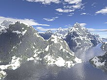
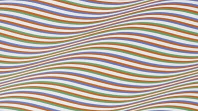
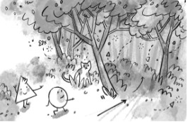

Investigación de técnicas generativas
Enunciado:

Investiga tres técnicas o algoritmos utilizados en la generación de contenido (por ejemplo, 
autómatas celulares, L-systems, ruido Perlin. Pero no tiene que ser estas, pueden ser algoritmos más simples). 
Para cada técnica:

#### Ruido Perlin

- Descripción: normalmente se usa de dos a cuatro dimensiones pero pueden ser mas, normalmente se usan tres pasos,
  crear un plano cartesiano con vectores de gradiente aleatorios, luego se computa el producto punto entre los vectores y los bordes y finalmente se interpolan esos valores.
- Ejemplos: Se pueden crear paisajes
  

 
- Potencial: es muy utilizado para la generacion de terrenos e imagenes de texturas.

#### Oscilaciones

- Descripción:se usan principios de trigonometria para aplicar ecuaciones en la imagen, creando efectos de ondulacion.
- Ejemplos: Se pueden crear piezas de arte alteradas de una fuente.
  

 
- Potencial: es muy utilizado para la generacion de terrenos e imagenes de texturas.

#### Aleatoriedad

- Descripción: se generan numeros los cuales son asignados a las variables, creando un producto diferente cada vez.
- Ejemplos: se puede inplementar en un videojuego para que un enemigo se mueva con distintos patrones.
  

 
- Potencial: es muy utilizado para la generacion de contenido en vivo o que se desea que sea unico en cada reproduccion.
