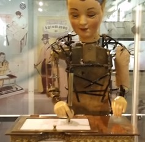
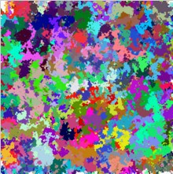

##### Automaton

- Descripción del proyecto: consta de una maquinaria con forma de humano. la cual genera arte unico.
- Técnicas generativas: pinones y demas maquinaria permiten que el automaton escriba de forma aleatoria.
  
- Análisis crítico:
  aspectos exitosos: para su epoca, era una maquina impresionante sin comparacion.

  posibles limitaciones: el proyecto carece de color al dibujar, se limita a sierta cantidad de movimientos.

##### Arte algoritmica

- Descripción del proyecto: consta de un software que permite crear el arte utilizando matematicas.
- Técnicas generativas: pinones y demas maquinaria permiten que el automaton escriba de forma aleatoria.
  
- Análisis crítico:
  aspectos exitosos: para su epoca, era una maquina impresionante sin comparacion.

  posibles limitaciones: el proyecto carece de color al dibujar, se limita a sierta cantidad de movimientos.

