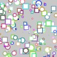

##### Random Shapes



```js
function setup() {
  createCanvas(100, 100);

  background(200);

  describe('Three horizontal black lines are filled in randomly. The top line spans entire canvas. The middle line is very short. The bottom line spans two-thirds of the canvas.');
}
function draw(){
  // Uniform distribution between 0 and 100.
  let a = random(2);
  let x = random(100);
  let y = random(100);
  let z = random(10);
  let r = random(255);
  let g = random(255);
  let b = random(255);
  
  stroke(r,g,b);
  
  switch (int(a)){
    case 0:
      circle(x, y, z);
      break;
    case 1:
      square(x, y, z);
      break;
    case 2:
      triangle(30, 75, 58, 20, 86, 75);
      break;
  }
  
}
```
