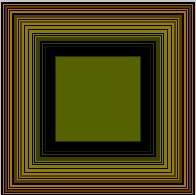

##### P_1_0_01



```js
screenwidth = 200;
screenHeight = 200;

function setup() {
  createCanvas(screenwidth, screenHeight);

  background(200);

}
function draw(){
  // Uniform distribution between 0 and 100.

  let x = mouseX;
  let y = mouseY;
  let z = 5;
  let c = color(x, y, 0);
  fill(c);
  
  square((screenwidth - x)/2, (screenHeight - x )/2, x);
  
}
```
