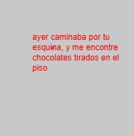
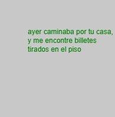

```js
screenwidth = 200;
screenHeight = 200;

function setup() {
  createCanvas(screenwidth, screenHeight);

  background(200);
  
  let r = random(3)
  let word1 = ["calle", "esquina", "casa"];
  let word2 = ['ramos de flores', 'chocolates',       'billetes'];
  let s = 'ayer caminaba por tu '+word1[int(r)]+', y me encontre '+ word2[int(r)]+ ' tirados en el piso'

  switch(int(r)){
    case 0:
      fill('yellow');
      break;
    case 1:  
      fill('red');
      break;
    case 2:
      fill('green');
      break;
  }
  text(s, 50, 50, 150, 150);
}
```
