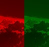

```js
let img;

// Load the image and create a p5.Image object.
function preload() {
  img = loadImage('/assets/Fractal_terrain_texture.jpg');
}

function setup() {
  createCanvas(100, 100);

  tint('red');
  image(img, 0, 0);

  tint('green');
  image(img, 50, 0);
}
```
