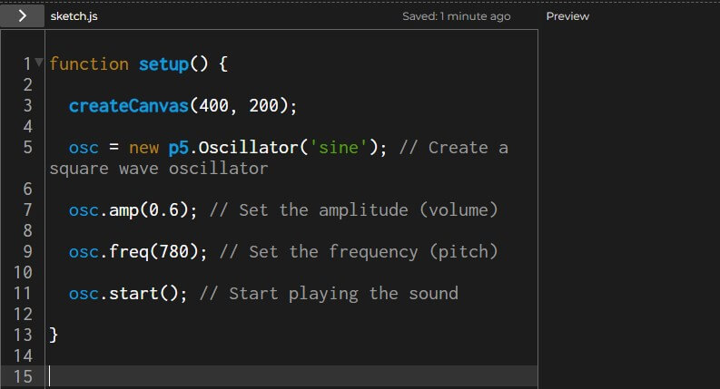

```js
function setup() {

  createCanvas(400, 200);

  osc = new p5.Oscillator('sine'); // Create a square wave oscillator

  osc.amp(0.6); // Set the amplitude (volume)

  osc.freq(780); // Set the frequency (pitch)

  osc.start(); // Start playing the sound

}
```


