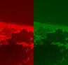
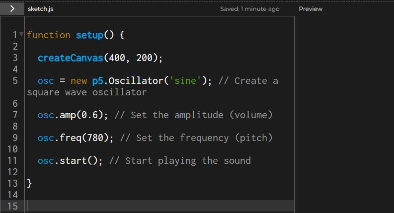

##### Random Shapes

- Descripción: el prototipo genera aleatoriamente la posicion y el color de las figuras.
- Análisis: funciono bien la generacion del color, el triangulo podria mejorarse siendo generado tambien aleatoriamente pero tendria un trabajo mas dificil.
- Aprendizaje: aprendi sobre los random en javascript, no tube dificultades

##### P_1_0_01

- Descripción: el prototipo toma la posicion del cursor y con base a ella cambia el color o el tamano del cuadrado dibujado.
- Análisis: Se podrian utilizar ecuaciones mas complejas para crear colores mas atractivos y correjir errores del dibujado.
- Aprendizaje: no tube dificultades.

##### Texto generativo 

- Descripción: hay unos array con palabras y un random elije cuales seran usadas en el texto a mostrar final.
- Análisis: la parte que mas se puede mejorar aqui es el texto, que tenga coherencia y sentido.
- Aprendizaje: aprendi a manejar textos en p5.js, no tube mayores dificultades.

##### Manipulacion de imagenes

- Descripción: la mitad de la imagen se tintura de color rojo y la otra mitad de verde.
- Análisis: se podria usar aleatoriedad para la seleccion de los colores haciendo mas interesante la pieza de arte.
- Aprendizaje: las imagenes se pueden teñir muy facil en p5.js, sin mayores dificultades.

##### Generacion de sonido

- Descripción: se genera una onda de sonido senoidal, se le modifican los parametros de frecuencia y amplitued
- Análisis: La frecuencia y la amplitud se podrian modificar con codigo aleatorio para hacerlos mas interesantes.
- Aprendizaje: aprendi a generar sonidos en p5.js, sin mayores dificultades.
