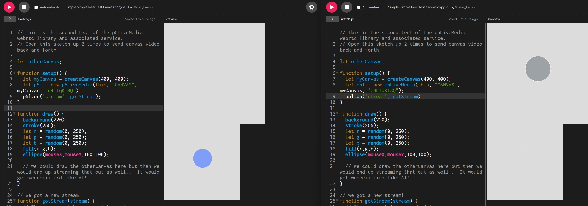

- Una aplicacion que envie la posicion de un canvas a otro, el cursor cambia de colores.
- Utiliza la bibioteca p5LiveMedia para compartir la informacion de una ventana del buscador a otra, moviendo el cursor.
- Describe cómo la aplicación propuesta se relaciona con el proyecto de curso.
- Es una forma de crear un software (pedazo de codigo) que genere el arte basandose en un input, en este caso el input seria el movimiento del mouse.
- Escribe un tutorial que permita replicar la aplicación propuesta.
- Se utilizo [este](https://editor.p5js.org/shawn/sketches/e4LTqKI8Q) sketch como referencia y se le agrego un sistema de cambio de color a la figura proyectada.

[**PROYECTO**](https://editor.p5js.org/Water_Lemur/sketches/D44iYLM-Vy)

```js
  let r = random(0, 250);
  let g = random(0, 250);
  let b = random(0, 250);
  fill(r,g,b);
```


  
```js
// This is the second test of the p5LiveMedia webrtc library and associated service.
// Open this sketch up 2 times to send canvas video back and forth

let otherCanvas;

function setup() {
  let myCanvas = createCanvas(400, 400);
  let p5l = new p5LiveMedia(this, "CANVAS", myCanvas, "e4LTqKI8Q");
  p5l.on('stream', gotStream);
}

function draw() {
  background(220);
  stroke(255);
  let r = random(0, 250);
  let g = random(0, 250);
  let b = random(0, 250);
  fill(r,g,b);
  ellipse(mouseX,mouseY,100,100); 
  
  // We could draw the otherCanvas here but then we would end up streaming that out as well..  It would get weeeeiiiiird like Al!
}

// We got a new stream!
function gotStream(stream) {
  // This is just like a video/stream from createCapture(VIDEO)
  otherCanvas = stream;
  //otherCanvas.id is the unique identifier for this peer
  //otherCanvas.hide();
}
```
