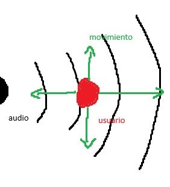

Aplicación interactiva dinámica y artística, en donde la posición del usuario altera la experiencia del sonido.
Con el uso del celular para registrar los movimientos como **input** y se procesaran para cambiar la música producida.

El **output** será una pieza artística usando el movimiento del usuario como intención.

El movimiento hacia la *derecha* será un sonido más *calmado*, mientras que el movimiento a la *izquierda* dará como resultado un sonido más *hostil*

