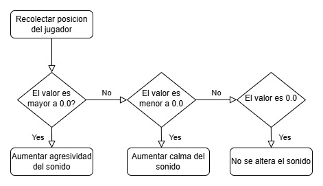

##### Inputs

-  **Fuente de datos**: Sensor, pulsador, control remoto.
   
-  **Inputs:** tabla o lista detallada (Fuente, Tipo, Rango/Formato, Simulación?, Conexión Storytelling).
  
| Input         | Tipo    | Rango      | Simulación | Storytelling            |
|---------------|---------|------------|------------|-------------------------|
| Acelerómetro | float   | 0.0-1.0    | No         | La posición como sonido |
| Pulsador      | boolean | true-false | No         | Cambio de ambientación  |

-   Conexion de inputs con storytelling:
    -   **Acelerómetro**: El movimiento del usuario transforma y moldea la cancion.
    -   **Pulsador**: Altera el genero de musica, creando un cambio en la ambientacion de la experiencia.

##### Algoritmo

-  Se recivira como *input* la posicion del usuario, esta sera en una medicion de 0.0 a 1.0, alterando el sonido producido dependiendo del valor.

  

  
