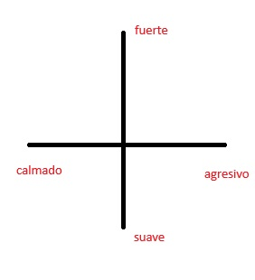

1.  **Detallar Inputs:**

    -  **Fuente de datos**: Sensor, pulsador, control remoto.
   
    -  **Inputs:** tabla o lista detallada (Fuente, Tipo, Rango/Formato, Simulación?, Conexión Storytelling).
  
| Input         | Tipo    | Rango      | Simulación | Storytelling            |
|---------------|---------|------------|------------|-------------------------|
| Acelerómetro | float   | 0.0-1.0    | No         | La posición como sonido |
| Pulsador      | boolean | true-false | No         | Cambio de ambientación  |

 -   Conexion de inputs con storytelling:
        -   **Acelerómetro**: El movimiento del usuario transforma y moldea la cancion.
        -   **Pulsador**: Altera el genero de musica, creando un cambio en la ambientacion de la experiencia.

2.  **Diseñar el Proceso (algoritmo):**

    -  Se recivira como *input* la posicion del usuario, esta sera en una medicion de 0.0 a 1.0, alterando el sonido producido dependiendo del valor.

  

  

   -   **Pseudocodigo**

```
SI input_movimiento > umbral ENTONCES aumentar_agresividad
SI input_movimiento < umbral ENTONCES aumentar_pasividad
SI input_movimiento = 0 ENTONCES   no_hacer_nada
```  
3.  **Especificar Outputs:**

    -   El tipo principal es sonoro.
    -   El sonido dependerá de la posición del usuario, el sonido será más ameno cuando el usuario se mueve a la izquierda y más agresivo cuando se mueva hacia la derecha. Será más fuerte cuando el usuario se mueva hacia adelante y más suave cuando se mueva para atrás.
    -   Se recogerá la posición del usuario como input y esta será transformada para producir un sonido único, un cambio en la posición y el sonido cambiara de tono, de ameno a agresivo y viceversa
    -   La posición del usuario *"contara"* una historia a medida que se mueva, creando una pieza de audio única
