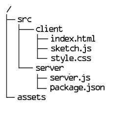

**archivos**



 - Me parece que es una forma muy buena de ordenar los archivos dependiendo de su uso.

**archivo html**

```html
  <head>
    <script src="https://cdn.jsdelivr.net/npm/p5@1.11.5/lib/p5.js"></script>
    <script src="https://cdnjs.cloudflare.com/ajax/libs/p5.js/1.11.3/addons/p5.sound.min.js"></script>
    <link rel="stylesheet" type="text/css" href="style.css">
    <meta charset="utf-8" />

  </head>
```

**archivo sketch.js**

```js
function setup() {
    createCanvas(400, 400);
  }
  
  function draw() {
    background(220);
  }
```
