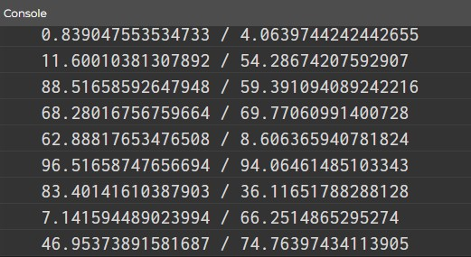
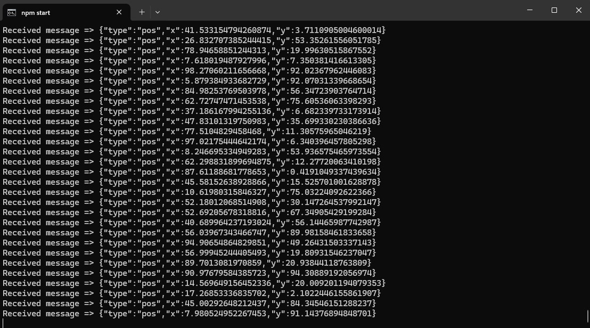
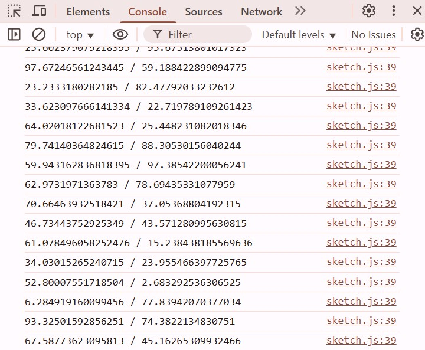

**sketch.js**

```js
let posX, posY;
let lastPosX, lastPosY;
let soundAggressiveness;

let simulate = true;

function setup() {
    createCanvas(400, 400);
  }
  
  function draw() {
    background(220);

    if (simulate){
        test();
    }

    takeData();
    processData();
    console.log(posX + " / " + posY);
  }

  function takeData(){

  }
  function processData(){
    if (posX > lastPosX){
        soundAggressiveness = posX - lastPosX;
    }
    else if(posX < lastPosX){
        soundAggressiveness = posX - lastPosX;
    }
    if (posY > lastPosY){
        increaseAudio();
    }
    else if (posY < lastPosY){
        decreaseAudio();
    }
  }
  function increaseAudio(){
    //TO DO
  }
  function decreaseAudio(){
    //TO DO
  }
  function test(){
    posX = random(0, 100);
  }
```

**console.log**







