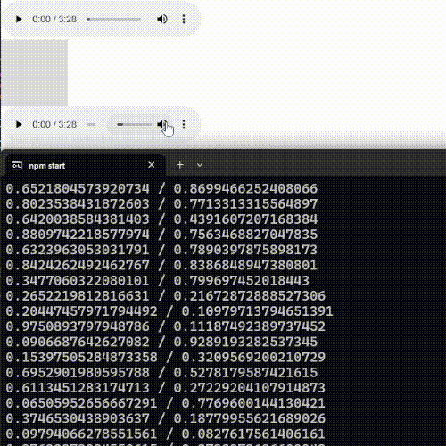

Describe al menos un error o comportamiento inesperado significativo que encontraste durante las pruebas.
Explica cómo utilizaste console.log u otras técnicas para identificar la causa de ese error.
Muestra el fragmento de código antes y después de la corrección (o explica claramente el cambio realizado).
Describe al menos un refinamiento estético o de comportamiento que realizaste y por qué lo consideraste necesario. Muestra el cambio en el código si es relevante.
Incluye una nueva captura de pantalla o GIF animado corto del prototipo después del refinamiento y la depuración. :::

- El error que se me presento es que aparecen dos interfaces de reproduccion del sonido, la primera no variaba de volumen, lo que me causo demora en las pruebas, pero luego me di cuenta que el segundo modulo de volumen si funciona y varia de volumen.

- El console.log fue indispensable para verificar si el servidor tenia contacto con el cliente, en las variables de prueba.

- fragmento de codigo despues de ponerle una variable que limite la cantidad de ciclos que se envia la informacion, para que no sea cada ciclo.

- ```js
  if(gate >= 100){
    gate = 0;
    console.log(posX + " / " + lastPosX);

    soundAggressiveness = posX - lastPosX;
    socket.broadcast.emit('audio', JSON.stringify(soundAggressiveness));
  }
  else{
    gate += 1;
  }
  ```

- Tengo un problema con el canvas que se imprime dos veces, de refinamiento estetico, decidi cambiar su tamaño para que sea mejor perceptible.

- gif:


